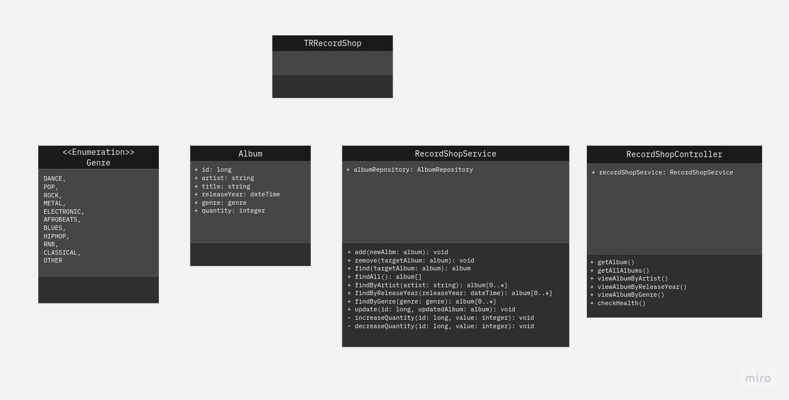

# TR Record Shop

### Contributors
- [Adrian Y]()
- [Chadrak H]()
- [Julian H]()

See the contribution guide, [here](Documentation/CONTRIBUTING.md).

## Documentation
The documentation of TR Record Shop includes:

- [Overview](#overview)
- [Planning](#planning)
- [Testing](#testing)

## Overview
[Project Board](https://trello.com/b/kpMuDXdZ/record-shop-backend)

The Record Shop backend is a program designed to allow the shop to store, update and query stock data, which is held an in-memory database.
This is accomplished by creating a Spring Boot application to design an API with specific mapping for viewing and performing operations upon the shop's inventory in various ways.
Users wil interact with the API using a command-line interface or an API platform such as [Postman](https://www.postman.com/), [Swagger](https://swagger.io/) or [curl](https://curl.se/).

## Planning
### User Journey
...

### Class Diagram

## Testing
...