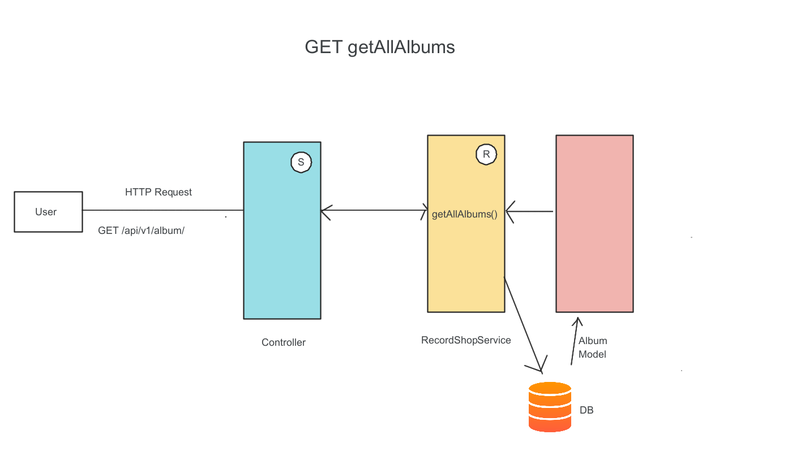
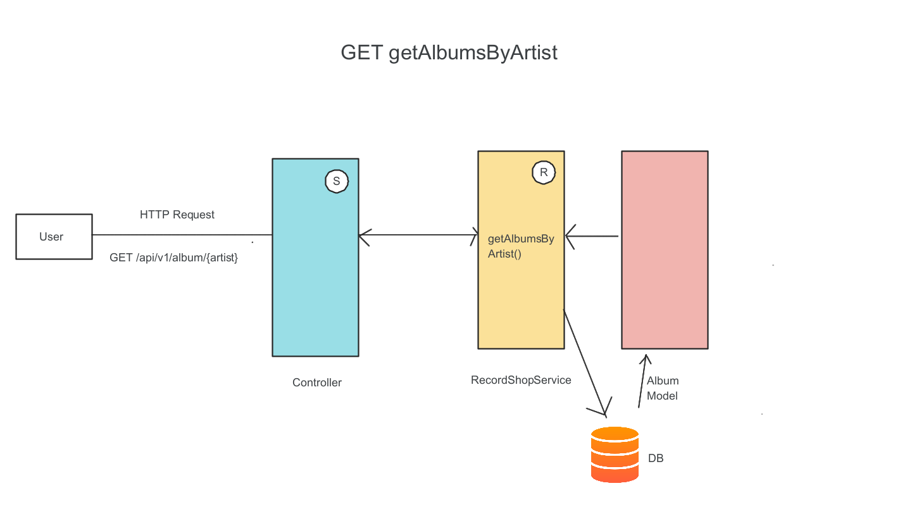
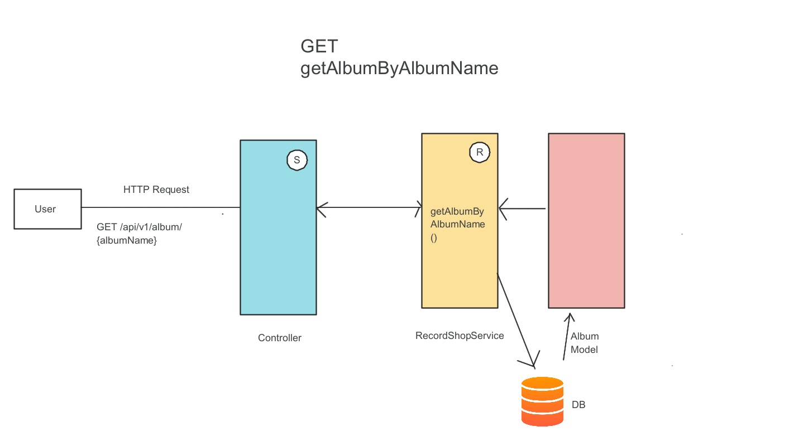
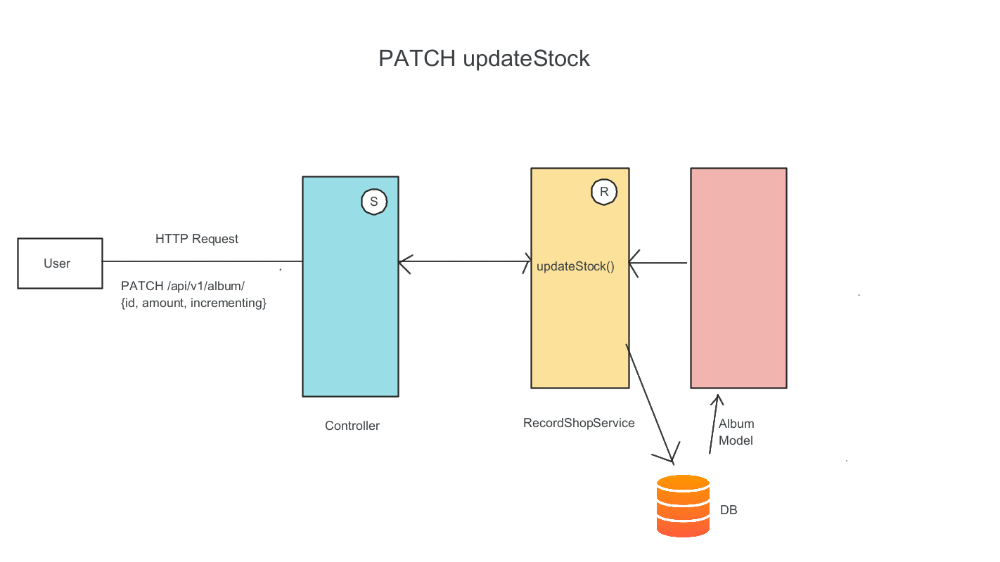
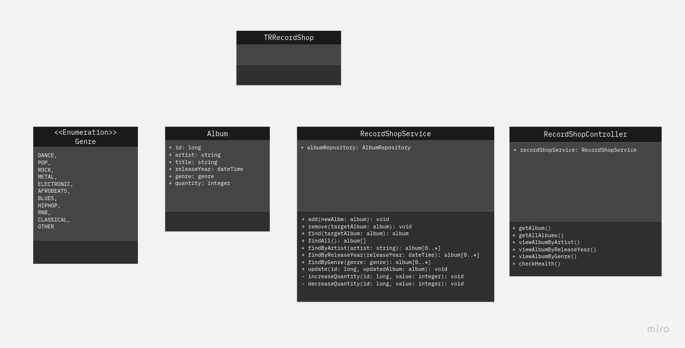

# TR Record Shop

## Documentation
The documentation of TR Record Shop includes:

- [Overview](#overview)
- [Planning](#planning)
- [Testing](#testing)
- [Contribution Guide](Documentation/CONTRIBUTING.md)

 

## Installation & Run Instructions

**1. Clone the repository:**  
git clone https://github.com/chadrakh/TRRecordShop

**2. Configure the database:**  
Edit the contents of the application.properties file to attach to a database, 
for example to attach to a H2 in-memory database use the following configuration:
   
  `spring.datasource.url=jdbc:h2:mem:testdb
   spring.datasource.driverClassName=org.h2.Driver  
   spring.datasource.username=sa  
   spring.datasource.password=xxxxxxx  
   spring.h2.console.enabled=true  
   spring.h2.console.path=/h2-console`  

**3. Build the application from the IDE:**  
    mvn clean install

**4. Run the application:**  
From the IDE, select Run TRRecordShop (from TRRecordShop.java) or Shift f10

The application is now available to explore using the following Endpoints

**5. Application Endpoints:**  
All endpoints are shown from: **hpps://localhost:8080**

**Welcome:** /api/v1/   
[Welcome](http://localhost:8080/api/v1/)

**GetAllAlbums:** GET /api/v1/albums/  
[GetAllAlbums](http://localhost:8080/api/v1/albums/)

**GetAlbumsBy:** GET /api/v1/album/?title || artist || releaseYear || genre 
[GetAlbumBy](http://localhost:8080/api/v1/album)   

**InsertAlbum:** POST /api/v1/album/  Requires [Album JSON](#album-json) body 
[PostAlbum](http://localhost:8080/api/v1/album/) 

**UpdateAlbum:**  PATCH /api/v1/album/update   Requires [Album JSON](#album-json) body    
[PatchAlbum](http://localhost:8080/api/v1/album/update/)  

**AlterStockLevel:**  PATCH /api/v1/album/update/stock/?id & amount & imcrement   
[PatchStockLevel](http://localhost:8080/api/v1/album/update/stock/) 

**DeleteAlbum:** DELETE /api/v1/album/delete/?id 
[DeleteAlbum](http://localhost:8080/api/v1/album/delete/) 

### Album Json
`{
"artist" :   "artist name",
"title" : "album title",  
"releaseYear" : "2005",  
"genre" : "POP",
"quantity" : "10"
}`

### Genres
    DANCE,
    POP,
    ROCK,
    METAL,
    ELECTRONIC,
    AFROBEATS,
    BLUES,
    HIPHOP,
    RNB,
    CLASSICAL,
    OTHER

 

## Overview
[Project Board](https://trello.com/b/kpMuDXdZ/record-shop-backend)

The Record Shop backend is a program designed to allow the shop to store, update and query stock data, which is held an in-memory database.
This is accomplished by creating a Spring Boot application to design an API with specific mapping for viewing and performing operations upon the shop's inventory in various ways.
Users wil interact with the API using a command-line interface or an API platform such as [Postman](https://www.postman.com/), [Swagger](https://swagger.io/) or [curl](https://curl.se/).

 

## Planning

### Assumptions
+ The stock level is populated when a new album is added to the database but can be 
updated as a separate operation afterwards
+ The list all albums by artist and get album by album name should support partial string matches and be case insensitive

### Approach
+ Apply a TDD
+ Design using OOP principals
+ Create the User stories and the UML document
+ Create the MVP, and if time add enhancements to the project
+ Create a shared GitHub repository that all can work from
+ Use branches for adding new features
+ Use a Trello board for listing and assigning tasks and  keeping track of progress
+ Prepare sample dataset that can be populated into the database
+ Use the H2 in-memory database and the H2-console to view and populate the contents of the Database
+ If time, then consider extending to use a PostGres database

### User Journey
...

 

### Class Diagram
...

 

## Testing
...

## TODO  
    • Implement the help endpoint (Spring Boot Actuator)
    • Add validation checks – e.g cannot reduce quantity to < 0, check for null returned in place of Album in case it can’t be found in database, check for duplicates? etc
    • Add exception processing and handling
    • Return appropriate status codes on errors
    • Extend the test cases to include edge cases
    